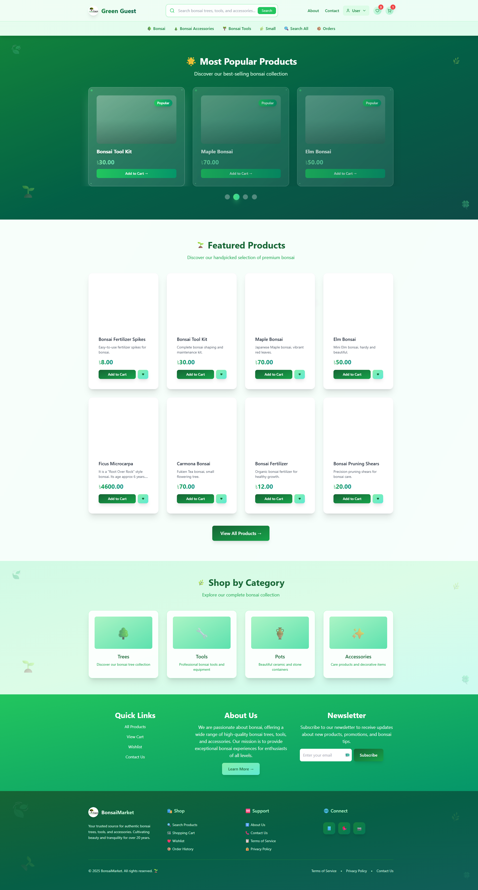
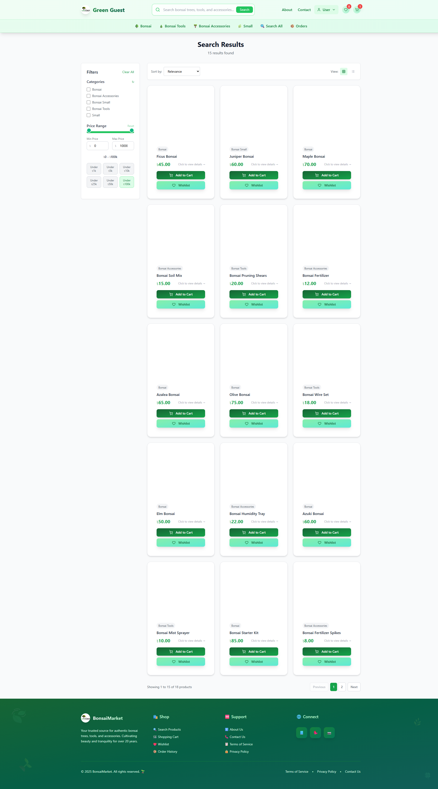
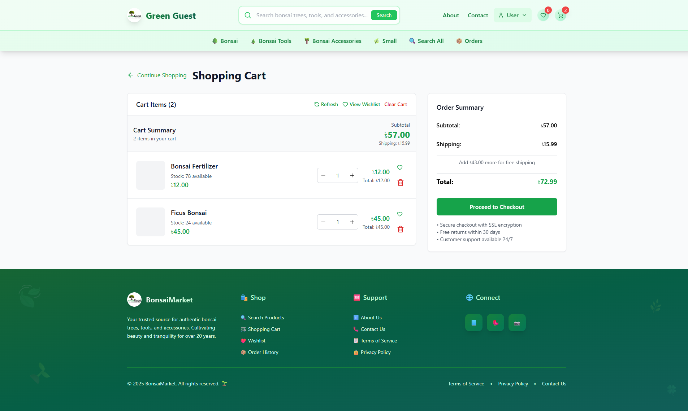
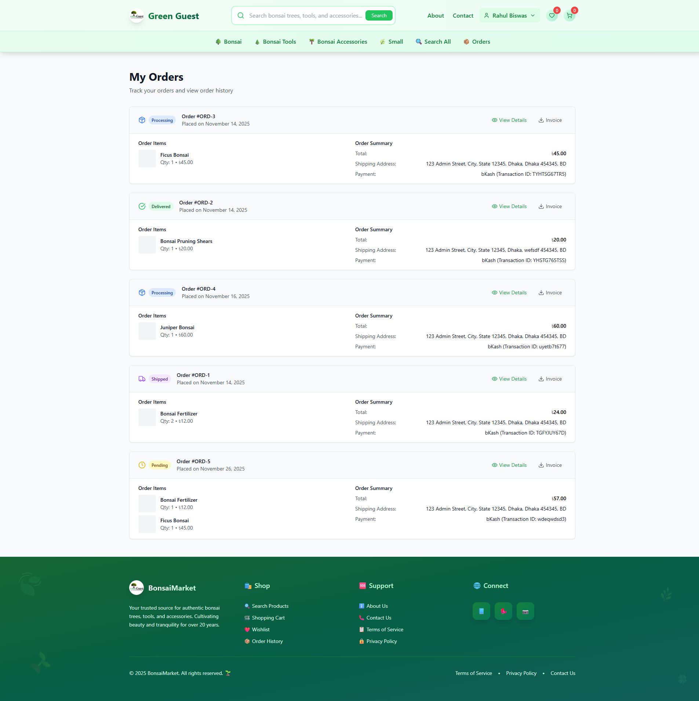
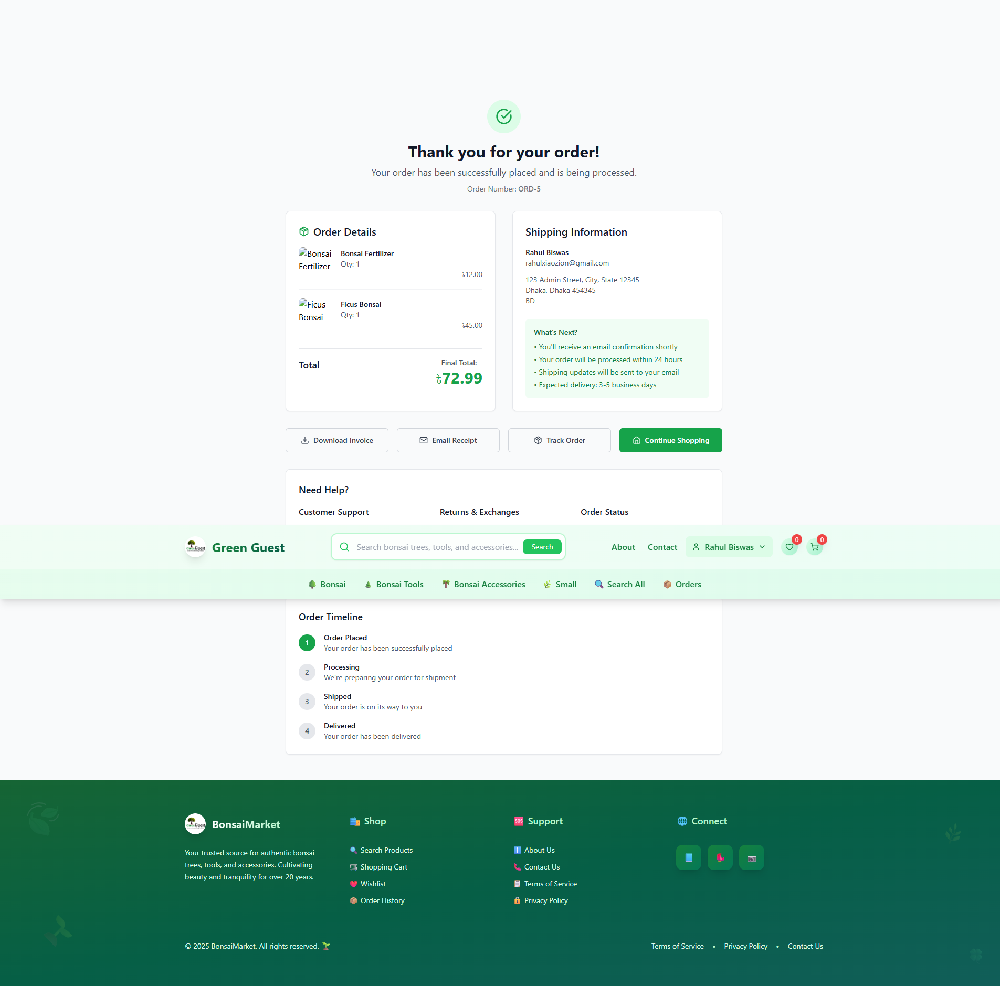
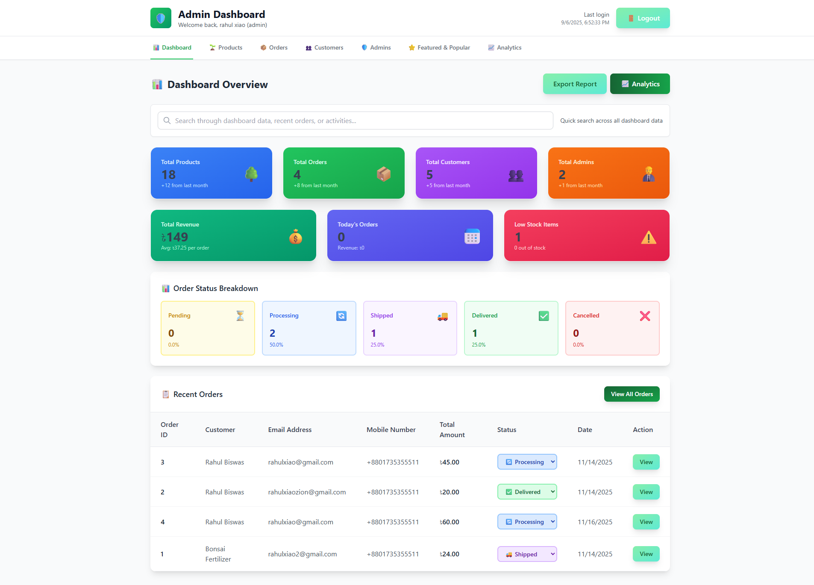
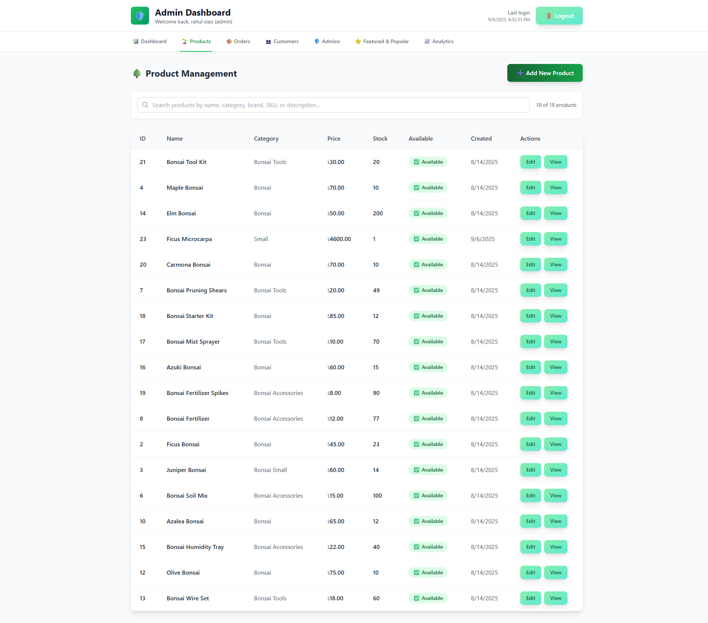
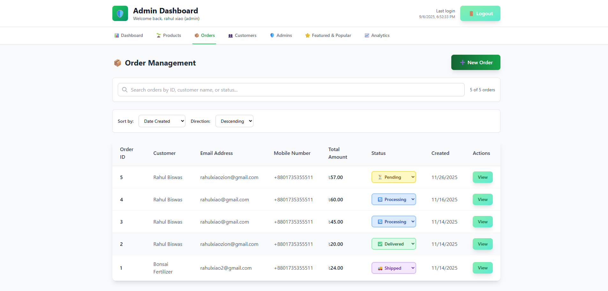
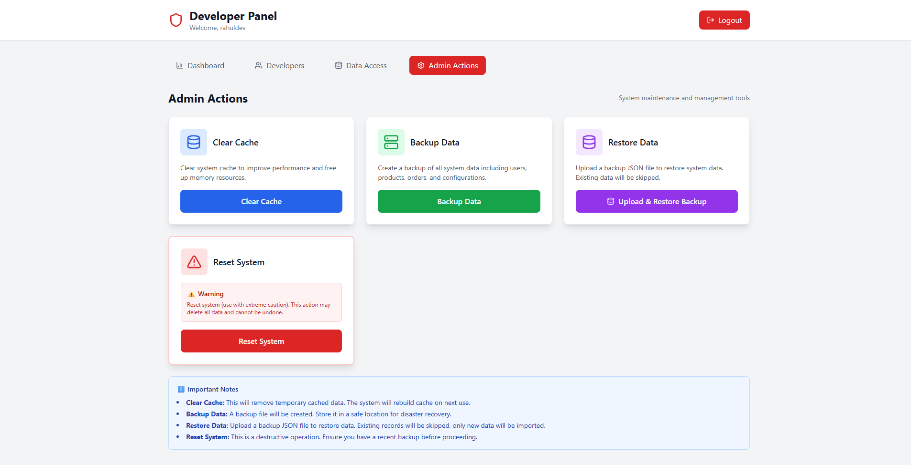

# 🌳 Bonsai E-Commerce Platform

A full-featured e-commerce web application for buying and selling bonsai plants and related products. This platform provides a seamless shopping experience with comprehensive admin controls and order management.

---

## 🎯 Project Overview

Bonsai-Project is a modern e-commerce solution built to showcase beautiful bonsai plants with a clean, intuitive interface. The platform includes customer-facing features, administrative controls, and developer tools for complete business management.

---

## ✨ Features Showcase

### 🏠 Homepage
A beautiful, engaging landing page that welcomes visitors and showcases featured bonsai products.

---

### 🔍 Smart Search
Powerful search functionality to help customers find exactly what they're looking for.

---

### 🛒 Shopping Cart
Intuitive cart management system for a smooth checkout experience.

---

### 📦 Order Management
Complete order tracking and management system for customers.

---

### 👨‍💼 Admin Dashboard
Comprehensive administrative interface for managing the entire platform.

---

### 📊 Product Management
Full control over product listings, inventory, and pricing.

---

### 📋 Order Administration
Track and manage all customer orders from a centralized dashboard.

---

### 🛠️ Developer Panel
Built-in developer tools for system management and monitoring.

---

## 🎨 Key Capabilities

- **Customer Features**
  - Browse beautiful bonsai product catalogs
  - Advanced search and filtering
  - Shopping cart management
  - Order placement and tracking
  
- **Admin Features**
  - Complete product management (Add, Edit, Delete)
  - Order processing and fulfillment
  - Dashboard analytics and insights
  - User management capabilities

- **Developer Tools**
  - System monitoring and debugging
  - Database management
  - Configuration controls

---

## 🌟 Built With Care

This project demonstrates a complete e-commerce solution with attention to user experience, admin functionality, and system management.

### 🛠️ Tech Stack

- **Frontend:** ⚡ Vite - Lightning-fast development and optimized production builds
- **Backend:** 🚀 NestJS - Progressive Node.js framework for scalable server-side applications

---

**Note:** This is a showcase project demonstrating full-stack e-commerce capabilities for bonsai plant retail.